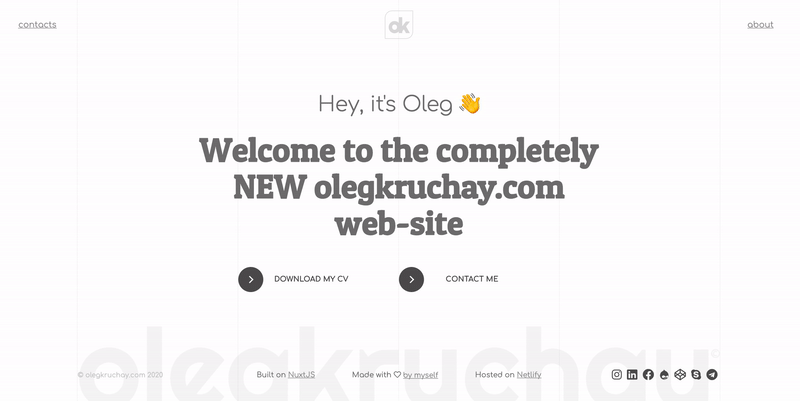

# ⛳️ Personal web-site | olegkruchay.com

###### 🎭🎲️ Current version ```v0.7.8 ßeta```

[](https://olegkruchay.com)

### 🔩🔧 Build Setup 

```bash
# install dependencies
$ yarn install

# serve with hot reload at localhost:3000
$ yarn dev

# build for production and launch server
$ yarn build
$ yarn start

# generate static project
$ yarn generate
```

For detailed explanation on how things work, check out [Nuxt.js docs](https://nuxtjs.org).

### 💎 Features 

- Made on NuxtJS (VueJS)
- Using the [olegkruchay-sync](https://classic.yarnpkg.com/en/package/olegkruchay-sync) NPM package for syncronizing reusable components/data between PET-projects
- 10-section based CSS Grid
- NuxtJS / VueJS Transitions
- SSR
- Error pages
- Drupal error pages relations
- The special pages: node/, node/1, admin/, user/

    
#### 🧨 Major updates 
- [olegkruchay-sync](https://classic.yarnpkg.com/en/package/olegkruchay-sync) NPM package
    - starts from version ```v0.7.7```
- Main pages: Home, About, Contacts
    - starts from version ```v0.7```
- Moving the G fonts into the separate library.
    - starts from version ```v0.6.4```

#### 💣 Features in future 

- Day/night mode
- custom cursor
- new page sections related to my experience and portfolio
- certificates on the site.
- special version of my cv
- [Dynamic gradient text function](https://www.sitepoint.com/dynamic-gradient-text-function-sass/)
- Adding the log with features into CHANGELOG.md
- All the icons of hovers should be super ellipse using: 
  - [CSS pseudo classes](http://jsfiddle.net/Lor0znhc/2/)
  - [SVG](https://medium.com/@nikolskayaolia/an-easy-way-to-implement-smooth-shapes-such-as-superellipse-and-squircle-into-a-user-interface-a5ba4e1139ed)
### ➡️🛠 Technologies 

- [NuxtJS](https://nuxtjs.org) ✅
  - starts from version ```v0.5```
- [VueJS](https://vuejs.org)
- ECMAScript 2020, JSON
- HTML template
- SCSS (Sass preprocessor)
- Google Analytics

### ↗️⚙️ Technologies in future 

- Migration from ```VueJS v2 to v3```
  - [VueJS 3 | Reliesed ](http://v3.vuejs.org/)
  - [NuxtJS 3](https://nuxtjs.org) 
  - TypeScript

This work is licensed under a [Creative Commons Attribution-ShareAlike 4.0 International License](https://creativecommons.org/licenses/by-sa/4.0/)

### Hosted on [Netlify](https://netlify.com). Made by Oleg Kruchay.
